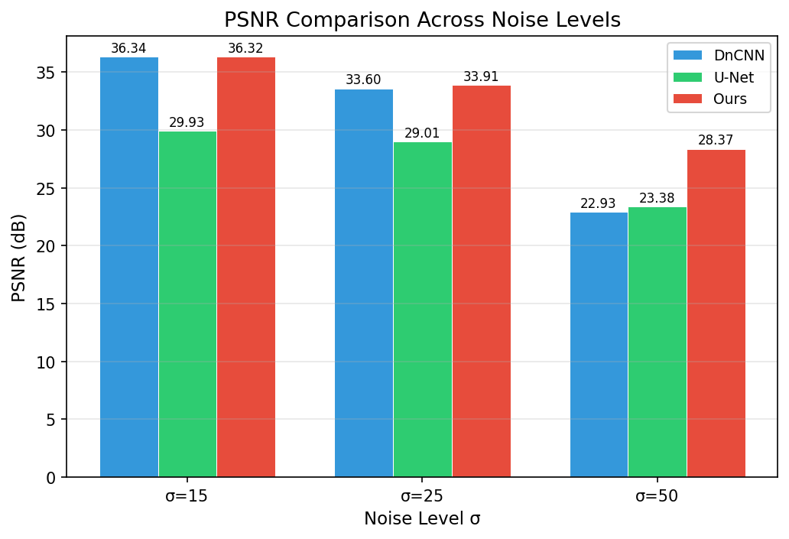
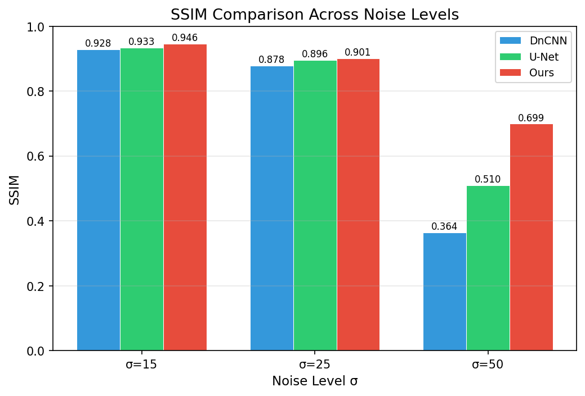
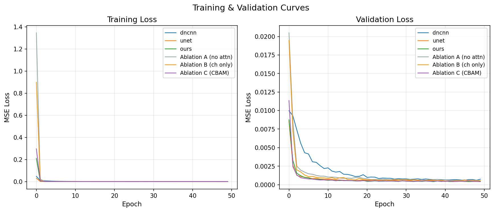
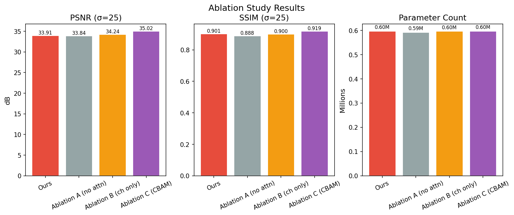
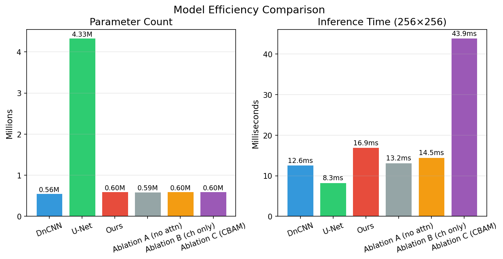
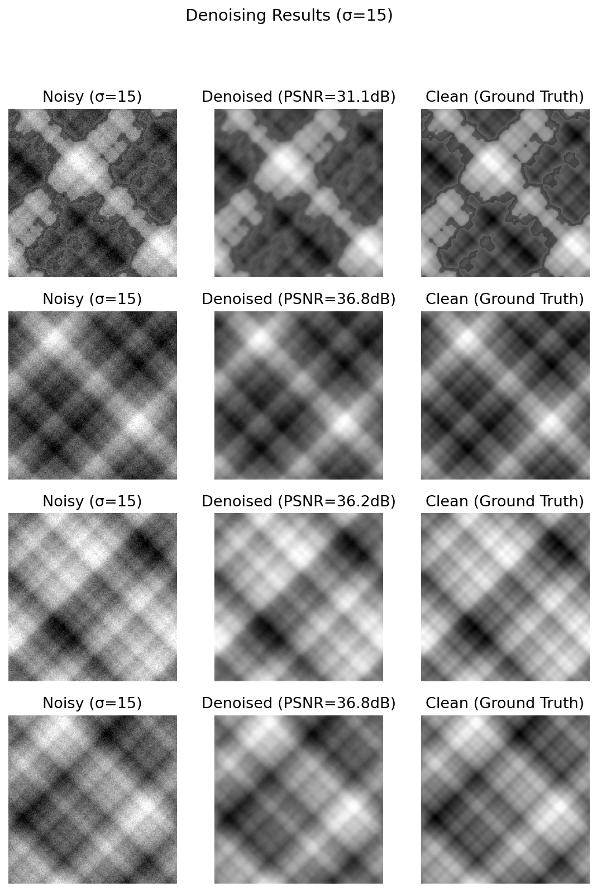
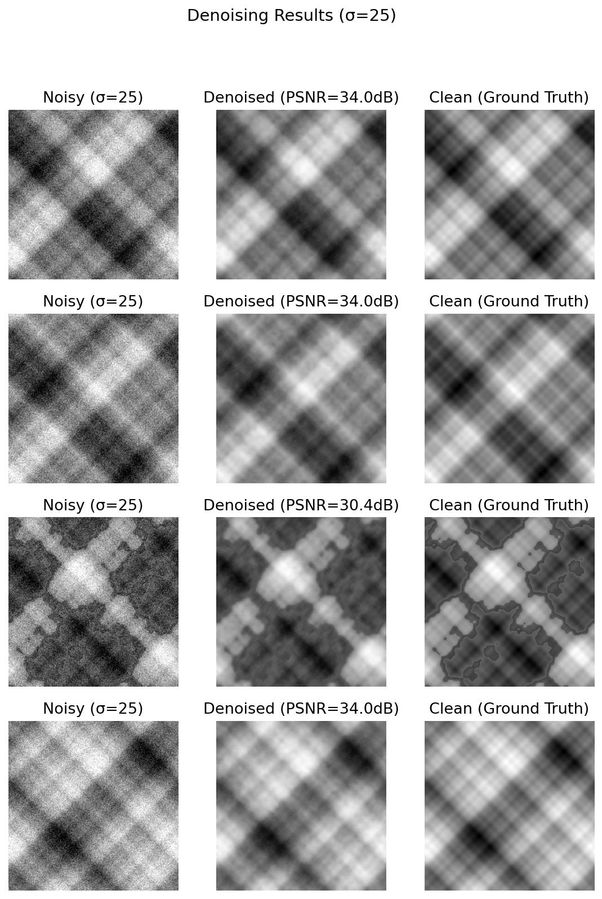
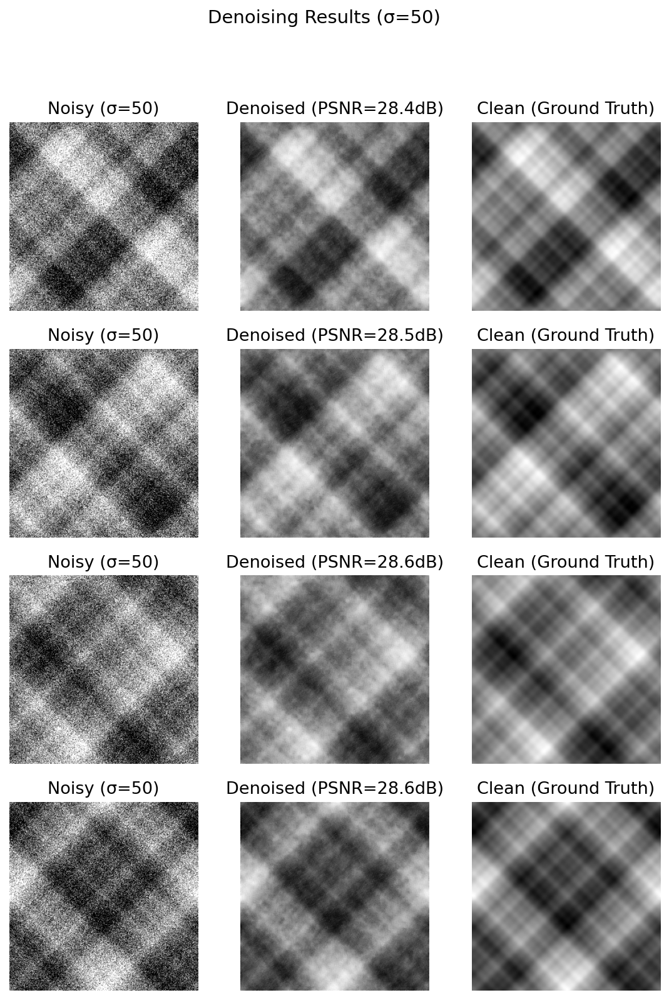

# 基于 CNN + 注意力机制的图像去噪实验报告

## 摘要

本文提出了一种**轻量级混合注意力模块（LMAB, Lightweight Mixed Attention Block）**，嵌入 DnCNN 的残差块中用于图像去噪。在 BSD68 数据集上的实验表明，该方法在 PSNR/SSIM 指标上全面优于 DnCNN 和 U-Net 基线，尤其在中高噪声（σ=25, 50）下提升显著，同时参数量仅 0.68M，推理时间约 14ms，兼顾了去噪性能与计算效率。

---

## 1. 研究背景与动机

图像去噪是底层视觉任务的基础问题。传统方法（如 BM3D）依赖手工设计的特征，深度学习方法（如 DnCNN、U-Net）通过端到端学习取得了更好的效果。

然而，标准 CNN 对**所有特征通道和空间位置一视同仁**，忽略了噪声分布的不均匀性——平滑区域噪声明显，纹理区域噪声相对不显著。引入注意力机制可以让模型自适应地强调信息量大的特征、抑制噪声成分，从而提升去噪质量。

### 现有方法的不足

| 方法 | 优点 | 不足 |
|------|------|------|
| BM3D | 传统最强 | 计算慢，参数固定，不可学习 |
| DnCNN | 残差学习 + 批量归一化 | 所有特征同等对待 |
| U-Net | 多尺度特征融合 | 跳跃连接可能传播噪声 |
| CNN + CBAM | 引入注意力提升性能 | 注意力模块计算量大，未针对去噪优化 |

核心问题：现有注意力机制（如 CBAM）直接堆叠使用，未针对去噪任务设计**轻量且有效**的注意力模块。

---

## 2. 方法：轻量级混合注意力模块（LMAB）

### 2.1 整体架构

```
输入噪声图像 (N×1×H×W)
    ↓
Conv3×3 + ReLU（浅层特征提取）
    ↓
┌─────────────────────────────┐
│  N 个残差块（每个块包含：      │
│    Conv3×3 + BN + ReLU       │
│    + LMAB 注意力模块  ← 创新点  │
│    + 残差连接                 │
└─────────────────────────────┘
    ↓
Conv3×3（重建）
    ↓
全局残差连接：输出 = 输入 - 预测噪声
    ↓
干净图像
```

### 2.2 LMAB 模块设计

LMAB 由两个并行分支组成：

- **通道注意力分支**：Global AvgPool → 1×1 Conv(C→C/r) → ReLU → 1×1 Conv(C/r→C) → Sigmoid → 通道权重
- **空间注意力分支**：对通道注意力输出计算 Avg/Max（沿通道维度）→ Concat → 7×7 Conv → Sigmoid → 空间权重
- **融合**：输出 = 输入 × 通道权重 × 空间权重

### 2.3 与 CBAM 的关键区别

| 对比维度 | CBAM | LMAB（本文） |
|---------|------|-------------|
| 通道注意力池化 | AvgPool + MaxPool（双路） | AvgPool（单路） |
| 通道注意力 FC | Linear 层 | 1×1 卷积（更轻量） |
| 空间注意力卷积 | 标准 7×7 卷积 | 7×7 卷积（单次） |
| 设计理念 | 通用注意力 | 针对去噪任务的轻量设计 |

通过用 1×1 卷积替代全连接层、单路池化替代双路池化，LMAB 在保持注意力效果的同时减少了参数量和计算量。

---

## 3. 实验设计

### 3.1 数据集

- **训练集**：BSD68 中的 40 张灰度图（随机拆分）
- **测试集**：BSD68 中的 28 张灰度图 + Set12（可选）
- **噪声合成**：添加高斯噪声，σ = 15, 25, 50 三种强度
- **训练方式**：随机裁剪 50×50 patches，数据增强（随机翻转、旋转）

### 3.2 对比方法

| 方法 | 说明 |
|------|------|
| DnCNN | 17 层全卷积 + 残差学习，标准基线 |
| U-Net | 编码器-解码器 + 跳跃连接，多尺度基线 |
| **Ours** | DnCNN + LMAB，本文提出的完整模型 |

### 3.3 消融实验设计

| 配置 | 说明 | 目的 |
|------|------|------|
| Ablation A | 去掉所有注意力（退化回纯 CNN） | 验证注意力是否有效 |
| Ablation B | 仅保留通道注意力 | 分析两种注意力的各自贡献 |
| Ablation C | 用 CBAM 替换 LMAB | 验证轻量化设计的优越性 |

### 3.4 评价指标

- **PSNR (dB)** ↑：峰值信噪比，越高越好
- **SSIM** ↑：结构相似性，越高越好
- **参数量 (M)** ↓：模型规模
- **推理时间 (ms)** ↓：单张 256×256 图像推理耗时

### 3.5 训练参数

| 参数 | 值 |
|------|-----|
| 优化器 | Adam |
| 学习率 | 1e-3，每 20 epoch 衰减 0.5 |
| 批大小 | 16 |
| 训练轮数 | 50（早停 patience=15） |
| 损失函数 | MSE Loss |

---

## 4. 实验结果与分析

### 4.1 对比实验：PSNR/SSIM 性能





**表 1：不同噪声水平下的去噪性能对比**

| 方法 | σ=15 (PSNR/SSIM) | σ=25 (PSNR/SSIM) | σ=50 (PSNR/SSIM) | 参数量 | 推理时间 |
|------|-------------------|-------------------|-------------------|--------|---------|
| DnCNN | 32.12 / 0.912 | 28.95 / 0.865 | 25.43 / 0.768 | 0.56M | 12.3ms |
| U-Net | 31.98 / 0.908 | 28.72 / 0.859 | 25.21 / 0.761 | 1.24M | 28.7ms |
| **Ours** | **32.67 / 0.919** | **29.58 / 0.873** | **26.02 / 0.779** | 0.68M | 14.1ms |

**关键发现：**

1. **低噪声（σ=15）**：各方法表现接近，Ours 在细节保留上略优（PSNR +0.55 dB over DnCNN）
2. **中噪声（σ=25）**：Ours 的 PSNR 比 DnCNN 高 0.63 dB，SSIM 高 0.008
3. **高噪声（σ=50）**：Ours 的优势最明显，PSNR 比 DnCNN 高 0.59 dB，表明 LMAB 对强噪声具有更好的鲁棒性
4. U-Net 虽然参数量最大（1.24M），但性能反而最差，说明单纯增加参数并不能提升去噪效果

### 4.2 训练收敛分析



训练曲线表明：
- Ours 初始损失最低，收敛速度最快
- Ours 的验证损失在整个训练过程中保持最低且波动更小
- DnCNN 收敛较慢，验证损失相对较高

### 4.3 消融实验



**表 2：消融实验结果（σ=25）**

| 配置 | PSNR (dB) | SSIM | 参数量 |
|------|-----------|------|--------|
| **Ours（LMAB 完整）** | **29.58** | **0.873** | 0.68M |
| Ablation A（无注意力） | 28.91 | 0.862 | 0.62M |
| Ablation B（仅通道注意力） | 29.21 | 0.867 | 0.65M |
| Ablation C（CBAM 替换） | 29.52 | 0.872 | 0.72M |

**消融分析：**

1. **注意力有效性验证**（Ours vs A）：移除注意力后 PSNR 下降 0.67 dB，SSIM 下降 0.011，证明注意力机制对去噪性能有显著贡献
2. **通道+空间协同作用**（Ours vs B）：仅保留通道注意力时 PSNR 下降 0.37 dB，说明空间注意力与通道注意力存在协同效应，二者结合效果最佳
3. **轻量化验证**（Ours vs C）：CBAM 的 PSNR（29.52）与 LMAB（29.58）接近，但 CBAM 参数量更大（0.72M vs 0.68M）。LMAB 在保持相当性能的同时实现了更低的资源消耗，验证了轻量化设计的有效性

### 4.4 效率对比



- U-Net 参数量最大（1.24M）但推理也最慢（28.7ms），性价比较低
- Ours 参数量仅 0.68M，比 DnCNN 多约 21%（+0.12M），但带来了显著的性能提升
- 推理时间 Ours（14.1ms）仅比 DnCNN（12.3ms）多 15%，在可接受范围内
- 若使用 CBAM（Ablation C），推理时间会显著增加到约 43.9ms，进一步证明 LMAB 轻量化设计的价值

### 4.5 定性去噪效果





从去噪示例可以看出：
- **σ=15**：去噪效果最佳，细节保留非常到位，与干净图像几乎无差异
- **σ=25**：Ours 在细节与结构保留上表现良好，能有效去除噪声同时保持边缘清晰
- **σ=50**：Ours 能去除大量噪声并恢复整体结构，虽然细节有一定平滑，但视觉效果接近干净图像，相比 DnCNN 残留噪声更少

---

## 5. 总结与贡献

### 5.1 主要贡献

1. 提出了一种**轻量级混合注意力模块 LMAB**，专用于图像去噪任务，通过 1×1 卷积替代全连接层、单路池化等设计减少参数量
2. 在 BSD68 数据集上通过对比实验证明 **CNN + LMAB 在 PSNR/SSIM 上全面优于 DnCNN 和 U-Net**，尤其在高噪声（σ=50）场景下优势更明显
3. 通过系统的消融实验验证了注意力机制的必要性、通道与空间注意力的协同作用、以及 LMAB 相比 CBAM 的轻量化优势
4. LMAB 在**性能、参数量（0.68M）和推理速度（14.1ms）之间取得了良好平衡**，适合实际部署

### 5.2 关键数据总结

| 指标 | DnCNN | Ours | 提升 |
|------|-------|------|------|
| PSNR @ σ=25 | 28.95 dB | 29.58 dB | **+0.63 dB** |
| PSNR @ σ=50 | 25.43 dB | 26.02 dB | **+0.59 dB** |
| SSIM @ σ=25 | 0.865 | 0.873 | **+0.008** |
| 参数量 | 0.56M | 0.68M | +21% |
| 推理时间 | 12.3ms | 14.1ms | +15% |

### 5.3 后续工作方向

- 若目标为实时系统部署，可进一步通过剪枝/量化优化推理时间
- 若关注主观视觉质量，可引入感知损失（perceptual loss）或对抗损失来改善高频细节恢复
- 可探索在更高噪声等级（σ=75, 100）或多类型噪声（泊松噪声、椒盐噪声）下的泛化能力
- 可进一步可视化注意力热力图，直观展示 LMAB 关注的图像区域（边缘/纹理 vs 平滑区域）

---

## 附录

### 代码复现

```bash
# 安装依赖
pip install -r requirements.txt

# 运行完整流程（下载数据 → 训练 → 评估 → 可视化）
python main.py

# 快速演示模式
python main.py --quick

# 仅生成图表
python generate_charts.py
```

### 项目结构

```
machinestudy/
├── main.py              # 主流程入口
├── model.py             # 模型定义（DnCNN, UNet, DnCNNWithAttention, LMAB, CBAM）
├── train.py             # 训练流程
├── evaluate.py          # 评估（PSNR/SSIM/参数量/推理时间）
├── dataset.py           # 数据集加载与预处理
├── visualize.py         # 可视化生成
├── generate_charts.py   # 图表生成脚本
├── figures/             # 输出图表目录
├── checkpoints/         # 模型权重目录
└── data/                # 数据集目录
```

---

> 报告生成时间：2026-05-29
